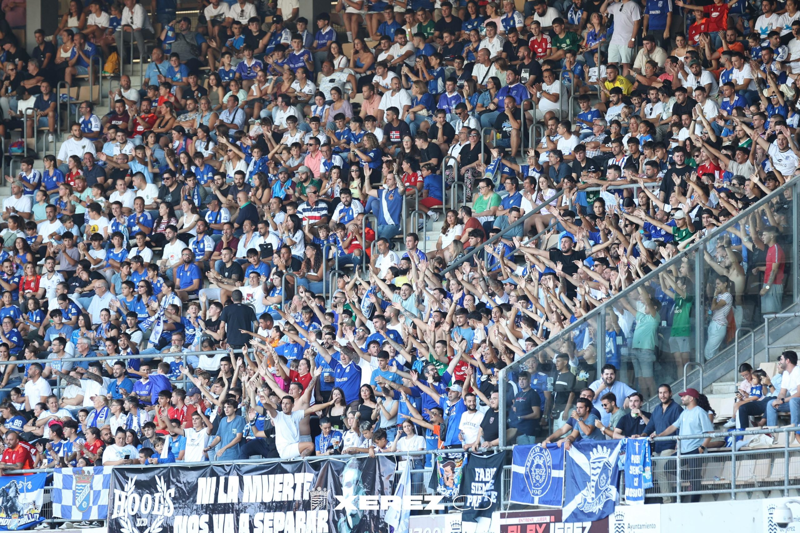
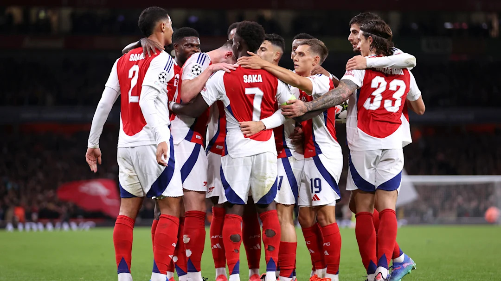

# Resultados de Fútbol

Aquí te mostraremos los resultados de fútbol más relevantes en  relación a tus equipos favoritos o más consultados. Disfruta del mejor fútbol y sus estadísticas aquí mismo. 😉

## Últimos resultados

### [Xerez CD - Juventud de Torremolinos](XerezCD-JuventudTorremolinos.md)

- Nané - 20'⚽ (XER **1** - 0 JTO)
- Nané - 43'⚽ (XER **2** - 0 JTO)
- Fran Castillo - 45'⚽(XER 2 - **1** JTO)
- D. Santisteban - 43'⚽ (XER **3** - 1 JTO)

### [FC Barcelona - Young Boys](FCBarcelona-YoungBoys.md)

- Lewandowski - 8'⚽ (FCB **1** - 0 YBO)
- Raphinha - 34'⚽ (FCB **2** - 0 YBO)
- Íñigo Martínez - 37'⚽ (FCB **1** - 0 YBO)
- Lewandowski - 51'⚽ (FCB **4** - 0 YBO)
- Aly Camara (OG) - 81'⚽ (FCB **5** - 0 YBO)

### [Arsenal - PSG](Arsenal-PSG.md)

- Kai Havertz - 20'⚽ (ARS **1** - 0 PSG)
- Bukayo Saka - 35'⚽ (ARS **2** - 0 PSG)

## Próximos partidos

### Xerez CD
- 🛫 | CA Antoniano - Xerez CD (6/10 - 12:00)
- 🏠 | Xerez CD - Cádiz Mirandilla (13/10 - 18:00)

### FC Barcelona
- 🛫 | Alavés - FC Barcelona (6/10 - 16:15)
- 🏠 | FC Barcelona - Sevilla FC (20/10 - 21:00)

### Arsenal
- 🏠 | Arsenal - Southampton (5/10 - 16:00)
- 🛫 | Bournemouth - Arsenal (19/10 - 18:30)
